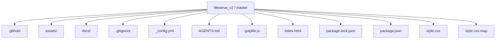
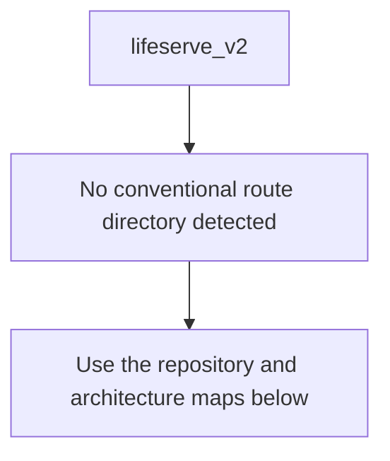
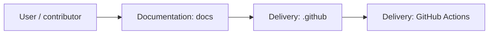
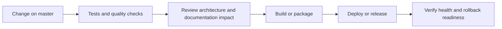
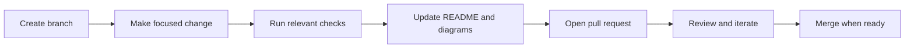

<!-- interactive-readme-standard:start -->

<div align="center">

# lifeserve_v2

**Branch-aware technical guide for [`master`](https://github.com/Nischhalsubba/lifeserve_v2/tree/master)**

<p>     </p>

<p>
  <a href="https://github.com/Nischhalsubba/lifeserve_v2/tree/master"><strong>Browse source</strong></a> ·
  <a href="https://github.com/Nischhalsubba/lifeserve_v2/issues"><strong>Issues</strong></a> ·
  <a href="https://github.com/Nischhalsubba/lifeserve_v2/codespaces/new?ref=master"><strong>Open in Codespaces</strong></a>
</p>

</div>

> [!IMPORTANT]
> This guide is generated from the files actually present on `master`. It links to detected source paths, preserves project-authored notes, and avoids claiming components that were not found.

## At a glance

| Item | Detected value |
|---|---|
| Purpose | A Sass project documented from the current branch structure and manifests. |
| Branch role | Default branch |
| Stack | Sass, JavaScript, HTML, CSS |
| Manifests | package.json |
| Prerequisites | Node.js |
| Delivery | GitHub Actions |
| License | No license file detected |

## Branch scope

This is the repository's default branch.


## Quick start

```bash
npm install
npm run test
```

### Configuration surface

- No committed environment example file was detected.

> Never commit secrets, private keys, production credentials, customer data, or unredacted infrastructure details.

## Repository map



| Responsibility | Detected source paths |
|---|---|
| Documentation | [`docs`](https://github.com/Nischhalsubba/lifeserve_v2/tree/master/docs) |
| Delivery | [`.github`](https://github.com/Nischhalsubba/lifeserve_v2/tree/master/.github) |

## Website or application map



## Architecture and responsibility flow




## Quality, security, and operations

<table>
<tr>
<td width="33%" valign="top">

### Quality

- No conventional test directory was detected automatically.

Detected commands:
- `npm run test`

</td>
<td width="33%" valign="top">

### Security

- No dedicated security policy or automated dependency configuration was detected.

Review authentication, authorization, input validation, dependency updates, secret handling, and failure recovery before release.

</td>
<td width="34%" valign="top">

### Observability

- No dedicated observability integration was detected automatically.

Define useful logs, metrics, traces, alerts, and rollback signals for production-facing branches.

</td>
</tr>
</table>

## Delivery flow



### Automation detected

- [`.github/workflows/apply-interactive-readme.yml`](https://github.com/Nischhalsubba/lifeserve_v2/blob/master/.github/workflows/apply-interactive-readme.yml)

## Contribution flow



- Keep changes focused and explain architectural consequences.
- Run the checks relevant to the changed area.
- Update diagrams whenever routes, modules, data models, authentication, jobs, or delivery paths change.
- Add screenshots or recordings for visual behavior changes when useful.
- Use issues for reproducible defects and pull requests for reviewable changes.

## Ownership and support

| Topic | Source |
|---|---|
| Repository | [`Nischhalsubba/lifeserve_v2`](https://github.com/Nischhalsubba/lifeserve_v2) |
| Branch | [`master`](https://github.com/Nischhalsubba/lifeserve_v2/tree/master) |
| Ownership | No CODEOWNERS file detected |
| Contributing | Use the contribution flow above |
| Support | [Open or review issues](https://github.com/Nischhalsubba/lifeserve_v2/issues) |
| License | No license file detected |

<details>
<summary><strong>Documentation maintenance checklist</strong></summary>

- [ ] Purpose and branch scope are accurate.
- [ ] Setup and configuration commands still work.
- [ ] Repository, application, API, data, authentication, job, and deployment diagrams match the code.
- [ ] Tests, security controls, observability, and rollback behavior are documented.
- [ ] Links point to real files on this branch.
- [ ] No secrets or private operational details are exposed.

</details>

<!-- interactive-readme-standard:end -->

<!-- project-authored-notes:start -->
<details>
<summary><strong>Project-authored notes preserved from this branch</strong></summary>

<div align="center">

# LifeServe V2

### Nonprofit / Service Organization Website Redesign

**A redesigned static website concept for LifeServe, focused on presenting services, programs, volunteer opportunities, news/events, donation/contact actions, and a cleaner responsive user experience.**


</div>

---

## ✨ Overview

**LifeServe V2** is a redesigned static website concept for a service-focused or nonprofit-style organization. The website direction is centered around making services, programs, volunteer opportunities, news/events, contact information, and donation-style actions easier to discover.

The project uses a classic static frontend stack: HTML, CSS, JavaScript, and Bootstrap.

---

## 🧭 Table of Contents

- [Project Purpose](#-project-purpose)
- [Designer’s Perspective](#-designers-perspective)
- [Suggested Sections](#-suggested-sections)
- [Features](#-features)
- [Tech Stack](#-tech-stack)
- [Run Locally](#-run-locally)
- [Deployment](#-deployment)
- [Quality Checklist](#-quality-checklist)
- [Roadmap](#-roadmap)
- [License](#-license)

---

## 🎯 Project Purpose

LifeServe V2 is intended to help an organization communicate:

- what services it provides
- who it supports
- how people can volunteer
- how people can donate or contact the organization
- upcoming events or updates
- trust-building information about its mission

---

## 🎨 Designer’s Perspective

A nonprofit or service organization website should feel helpful, trustworthy, and easy to navigate.

Important UX priorities:

- clear mission statement
- visible primary CTA
- accessible service information
- simple volunteer/donation paths
- readable event/news sections
- mobile-friendly layouts
- warm but professional visual identity

---

## 🧱 Suggested Sections

| Section | Purpose |
|---|---|
| Hero | Introduce the mission and primary CTA |
| Services | Explain what the organization provides |
| Programs | Highlight active initiatives |
| News / Events | Share updates and upcoming activity |
| Volunteer | Encourage participation |
| Donate / Contact | Convert interest into support/action |
| Footer | Contact details, social links, and important resources |

---

## 🌟 Features

| Feature | Description |
|---|---|
| Responsive UI | Layout intended for desktop and mobile |
| Service sections | Clear organization of programs/services |
| News/events blocks | Supports updates and event visibility |
| Contact/donation direction | CTA areas for action-oriented visitors |
| Bootstrap layout | Familiar grid and responsive behavior |

---

## 🛠 Tech Stack

| Layer | Technology |
|---|---|
| Markup | HTML |
| Styling | CSS |
| Layout | Bootstrap |
| Interactions | JavaScript |

---

## 🚀 Run Locally

Open the main HTML file directly in a browser, or run a local static server:

```bash
python -m http.server 8000
```

Then open:

```text
http://127.0.0.1:8000/
```

---

## 🌐 Deployment

This static website can be deployed to:

- GitHub Pages
- Netlify
- Vercel
- Cloudflare Pages
- shared hosting / cPanel

---

## ✅ Quality Checklist

### Content QA

- [ ] Mission statement is clear.
- [ ] Service descriptions are updated.
- [ ] Volunteer/donation CTAs are accurate.
- [ ] Contact details are correct.
- [ ] Events/news are current.

### Design QA

- [ ] Hero CTA stands out.
- [ ] Mobile layout is readable.
- [ ] Color contrast is accessible.
- [ ] Navigation labels are clear.
- [ ] Forms are easy to understand.

### Technical QA

- [ ] All HTML files load.
- [ ] CSS and JS paths work.
- [ ] Bootstrap loads correctly.
- [ ] Forms have validation or clear backend plan.
- [ ] Images are optimized.

---

## 🗺 Roadmap

- Add CMS or headless CMS support.
- Add accessible navigation improvements.
- Add donation/contact integration.
- Add real event/news content.
- Add SEO and Open Graph metadata.
- Add screenshot previews to README.

---

## 📜 License

This project is licensed under the **MIT License**.

---

<div align="center">

A service-organization website redesign focused on clarity, trust, and action.

</div>

</details>
<!-- project-authored-notes:end -->
