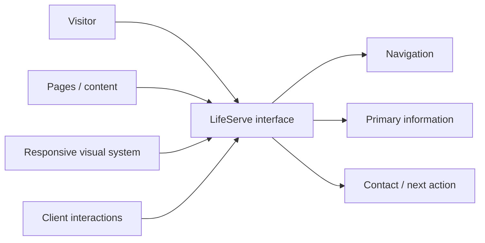
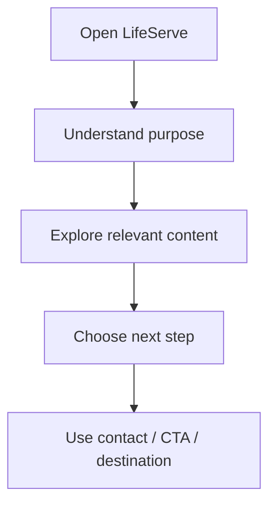
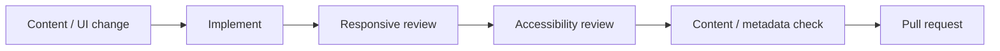

<div align="center">

# LifeServe v2

**The second-generation LifeServe web project, documented around its public experience, responsive interface, implementation flow, and maintainable content structure.**


[Browse source](https://github.com/Nischhalsubba/lifeserve_v2/tree/master) · [Issues](https://github.com/Nischhalsubba/lifeserve_v2/issues)

</div>

## Overview

**LifeServe v2** is a web-project repository. This README gives visitors and non-technical stakeholders a simple journey map while giving developers and designers a shared view of presentation, interaction, content, and delivery.

<details open>
<summary><strong>🏗️ Interactive website architecture</strong></summary>



</details>

## Visitor flow



## Audience guide

| Audience | Focus |
|---|---|
| Visitors | Clear information and next actions |
| Developers | Structure, behavior, assets and delivery |
| Designers | Hierarchy, responsive states and accessibility |
| Content owners | Accurate copy, links, media and metadata |

## Getting started

```bash
git clone https://github.com/Nischhalsubba/lifeserve_v2.git
cd lifeserve_v2
```

Use the runtime and package manager indicated by the committed project files.

## Design & accessibility

Keep content understandable without relying on animation, preserve visible focus and keyboard use, maintain responsive layouts and readable contrast, and ensure important actions are labeled by purpose rather than visual position alone.

## SEO & discoverability

Use a specific LifeServe title and description, semantic headings, descriptive links, accurate page terminology, meaningful image alternatives, canonical URLs, and social metadata. Add sitemap/robots support when appropriate to the deployed site.

## Contribution flow


