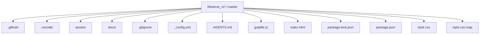
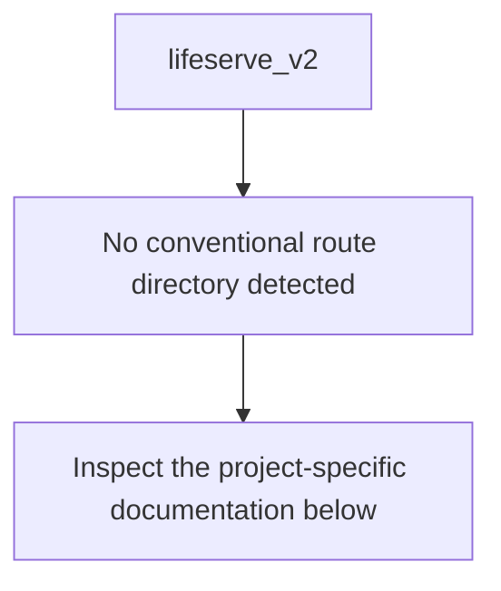
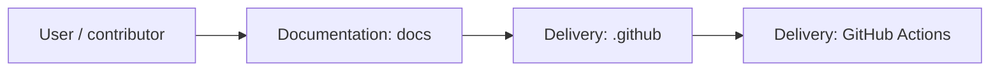
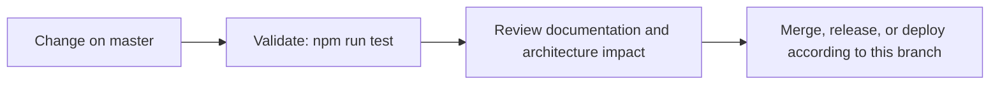

<div align="center">

# LifeServe V2

<!-- interactive-readme-standard:start -->

> [!NOTE]
> **Branch-specific documentation:** this section is maintained for [`master`](https://github.com/Nischhalsubba/lifeserve_v2/tree/master). It is generated from the files present on this branch and preserves the project-authored README below.

<details open>
<summary><strong>Interactive repository guide</strong></summary>

## Branch overview

| Item | Value |
|---|---|
| Repository | [`Nischhalsubba/lifeserve_v2`](https://github.com/Nischhalsubba/lifeserve_v2) |
| Branch | [`master`](https://github.com/Nischhalsubba/lifeserve_v2/tree/master) |
| Detected stack | Sass, JavaScript, HTML, CSS |
| Detected manifests | package.json |
| Documentation policy | Every maintained branch must explain purpose, setup, structure, architecture, flows, testing, delivery, security, and ownership. |

## Repository structure



The diagram is generated from the branch's actual top-level files and directories. Use the branch link above for complete source navigation.

## Website or application structure



## Application and responsibility flow



## Change-to-delivery flow



## README requirements for this branch

- Explain what this branch contains and how it differs from the default branch.
- Keep installation, configuration, usage, testing, deployment, security, support, and license information accurate.
- Document repository, website or application, API, data, authentication, background-job, and deployment flows when they exist.
- Prefer Mermaid diagrams and expandable `<details>` sections for visual navigation.
- Link diagrams and modules to real source paths; never invent missing components.
- Preserve project-specific documentation and update diagrams whenever architecture or major paths change.
- Treat secrets, private infrastructure, customer data, and credentials as prohibited README content.

</details>

<!-- interactive-readme-standard:end -->

### Nonprofit / Service Organization Website Redesign

**A redesigned static website concept for LifeServe, focused on presenting services, programs, volunteer opportunities, news/events, donation/contact actions, and a cleaner responsive user experience.**


</div>

---

## ✨ Overview

**LifeServe V2** is a redesigned static website concept for a service-focused or nonprofit-style organization. The website direction is centered around making services, programs, volunteer opportunities, news/events, contact information, and donation-style actions easier to discover.

The project uses a classic static frontend stack: HTML, CSS, JavaScript, and Bootstrap.

---

## 🧭 Table of Contents

- [Project Purpose](#-project-purpose)
- [Designer’s Perspective](#-designers-perspective)
- [Suggested Sections](#-suggested-sections)
- [Features](#-features)
- [Tech Stack](#-tech-stack)
- [Run Locally](#-run-locally)
- [Deployment](#-deployment)
- [Quality Checklist](#-quality-checklist)
- [Roadmap](#-roadmap)
- [License](#-license)

---

## 🎯 Project Purpose

LifeServe V2 is intended to help an organization communicate:

- what services it provides
- who it supports
- how people can volunteer
- how people can donate or contact the organization
- upcoming events or updates
- trust-building information about its mission

---

## 🎨 Designer’s Perspective

A nonprofit or service organization website should feel helpful, trustworthy, and easy to navigate.

Important UX priorities:

- clear mission statement
- visible primary CTA
- accessible service information
- simple volunteer/donation paths
- readable event/news sections
- mobile-friendly layouts
- warm but professional visual identity

---

## 🧱 Suggested Sections

| Section | Purpose |
|---|---|
| Hero | Introduce the mission and primary CTA |
| Services | Explain what the organization provides |
| Programs | Highlight active initiatives |
| News / Events | Share updates and upcoming activity |
| Volunteer | Encourage participation |
| Donate / Contact | Convert interest into support/action |
| Footer | Contact details, social links, and important resources |

---

## 🌟 Features

| Feature | Description |
|---|---|
| Responsive UI | Layout intended for desktop and mobile |
| Service sections | Clear organization of programs/services |
| News/events blocks | Supports updates and event visibility |
| Contact/donation direction | CTA areas for action-oriented visitors |
| Bootstrap layout | Familiar grid and responsive behavior |

---

## 🛠 Tech Stack

| Layer | Technology |
|---|---|
| Markup | HTML |
| Styling | CSS |
| Layout | Bootstrap |
| Interactions | JavaScript |

---

## 🚀 Run Locally

Open the main HTML file directly in a browser, or run a local static server:

```bash
python -m http.server 8000
```

Then open:

```text
http://127.0.0.1:8000/
```

---

## 🌐 Deployment

This static website can be deployed to:

- GitHub Pages
- Netlify
- Vercel
- Cloudflare Pages
- shared hosting / cPanel

---

## ✅ Quality Checklist

### Content QA

- [ ] Mission statement is clear.
- [ ] Service descriptions are updated.
- [ ] Volunteer/donation CTAs are accurate.
- [ ] Contact details are correct.
- [ ] Events/news are current.

### Design QA

- [ ] Hero CTA stands out.
- [ ] Mobile layout is readable.
- [ ] Color contrast is accessible.
- [ ] Navigation labels are clear.
- [ ] Forms are easy to understand.

### Technical QA

- [ ] All HTML files load.
- [ ] CSS and JS paths work.
- [ ] Bootstrap loads correctly.
- [ ] Forms have validation or clear backend plan.
- [ ] Images are optimized.

---

## 🗺 Roadmap

- Add CMS or headless CMS support.
- Add accessible navigation improvements.
- Add donation/contact integration.
- Add real event/news content.
- Add SEO and Open Graph metadata.
- Add screenshot previews to README.

---

## 📜 License

This project is licensed under the **MIT License**.

---

<div align="center">

A service-organization website redesign focused on clarity, trust, and action.

</div>
