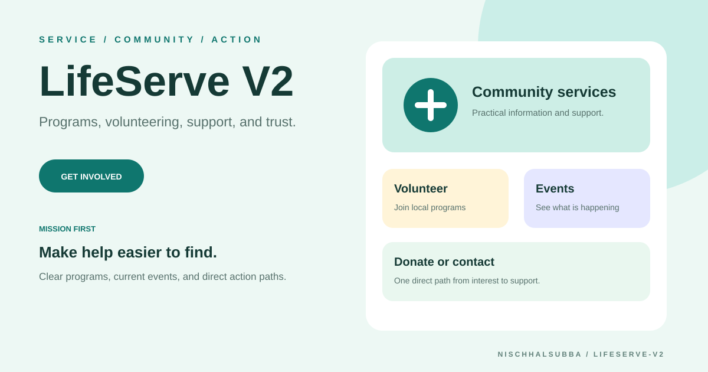

# LifeServe V2 Repository Overview

## Classification

Static nonprofit or service-organization website redesign using HTML, CSS, JavaScript, and Bootstrap.

- Intended areas: mission, services, programs, events, volunteering, donation, and contact
- Deployment: not verified
- Donation and contact integrations: not confirmed
- Fresh screenshot: unavailable because public hosts could not be resolved
- Visual above: designed repository thumbnail, not a runtime screenshot

## Highest-priority checks

1. Verify organization identity, mission, services, events, and contact details.
2. Confirm every donate, volunteer, and form action before publishing.
3. Remove stale news and event content.
4. Test keyboard access, mobile layout, contrast, and form feedback.
5. Add metadata, social preview, privacy information, and trustworthy donation handling.